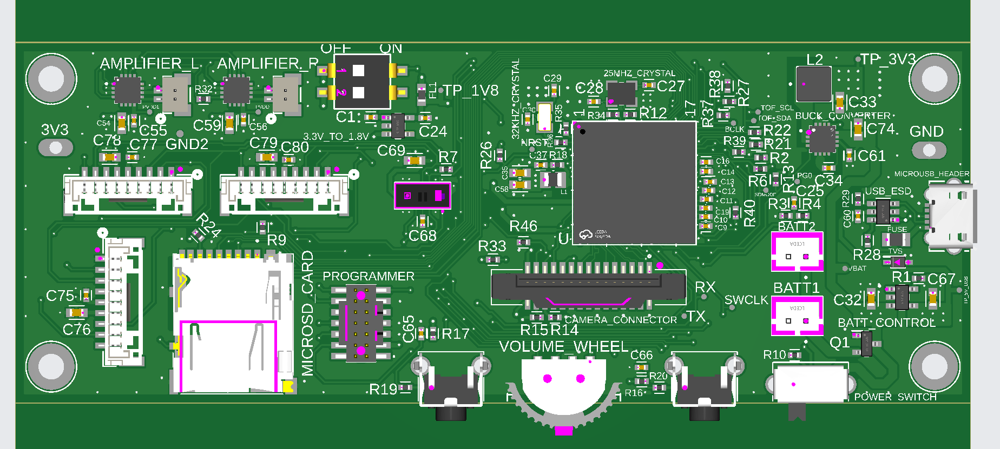
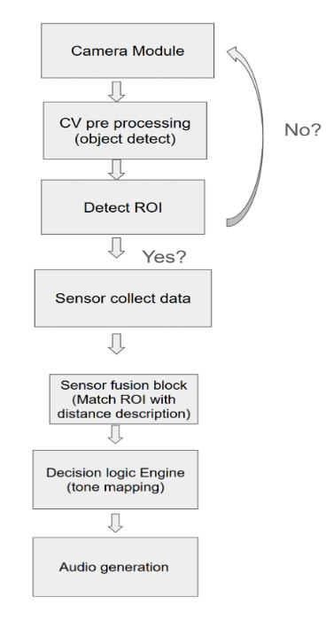
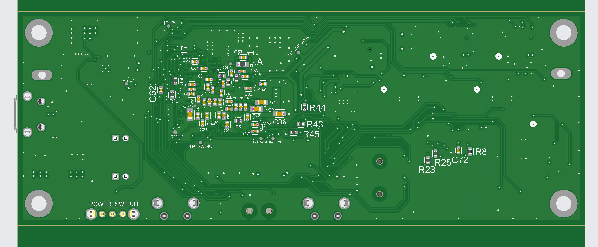

# Claritone

A wearable head-mounted assistive device for visually impaired users that detects obstacles in real time using time-of-flight sensors and a camera, then communicates their distance, position, and speed through spatial audio cues.

Developed as a senior design project (ESE440/ESE441) at Stony Brook University, Spring 2025 – Spring 2026.



## System Overview

Claritone combines multizone ToF ranging with camera-based object detection running on an STM32N6 neural-processing MCU. When an obstacle is identified, the system generates a spatialized audio tone through stereo speakers that conveys the object's location relative to the user.



## Hardware

**Custom PCB (Claritone Main Board)**

| Parameter | Value |
|---|---|
| Dimensions | 110 mm x 41.5 mm |
| Layer count | 4-layer FR-4 |
| MCU | STM32N657X0H3Q (Cortex-M55 + Neural-ART NPU, VFBGA-264) |
| ToF sensors | 1x VL53L7CX on-board + 3x SATEL-VL53L7CX breakouts via JST-GH |
| Camera | Arducam IMX335 via 15-pin MIPI CSI FPC connector |
| Audio output | 2x MAX98357A I2S Class-D amplifiers (stereo) |
| Power | 2x 3000 mAh LiPo cells in parallel, MCP73831T charge management, TPS62132 buck (3.3V), TPS7A2018 LDO (1.8V) |
| Charging | Micro-USB (power only) |
| Storage | MicroSD via SDMMC1 |
| Debug | STLINK-V3MINIE via STDC14 header (SWD + VCP) |
| Fabrication | JLCPCB (4-layer, ENIG finish) |



## Folder Structure

```
Claritone/
├── Appli/                  # Application firmware
│   ├── Inc/                # Header files
│   ├── Src/                # Source files
│   ├── Spatial-Sound/      # Spatial audio algorithm
│   └── ToF/                # VL53L7CX driver porting layer
│       └── Platform/       # MCU-specific I2C platform abstraction
├── FSBL/                   # First-stage bootloader
│   ├── Inc/                # Header files
│   └── Src/                # Source files
├── hardware/
│   ├── schematic/          # Schematic PDFs
│   └── bom/                # Bill of materials
├── docs/
│   └── images/             # Photos, renders, block diagrams
└── README.md
```

## Detection Pipeline

1. Pre-trained computer vision model (deployed via ST Model Zoo on the Neural-ART NPU) identifies a region of interest in the camera frame
2. VL53L7CX ToF sensors measure the distance, position, and speed of the detected object
3. Spatial audio algorithm generates a stereo tone with equal-power panning, interaural time delay, and distance attenuation to convey the object's location to the user

## Building and Flashing

### Requirements
- STM32CubeIDE
- STM32CubeProgrammer (CLI recommended for STM32N6)
- STLINK-V3MINIE debugger (firmware V3J17M10 or later)

### Steps
1. Open the project in STM32CubeIDE
2. Build the FSBL sub-project first
3. Build the Appli sub-project
4. Flash via SWD using STM32CubeProgrammer CLI

> **Note:** The STM32N657 requires dev boot mode (BOOT1 high) for SRAM write access and debug. On the custom PCB, this is set via a DIP switch on BOOT0 and BOOT1 (PA6).

## Team

Built by a three-person team at Stony Brook University. Contributions span hardware design, firmware development, enclosure design, and audio algorithm development.

## License

This project was developed for academic purposes. The VL53L7CX ULD driver (STSW-IMG036) is not included in this repository due to ST redistribution restrictions.
